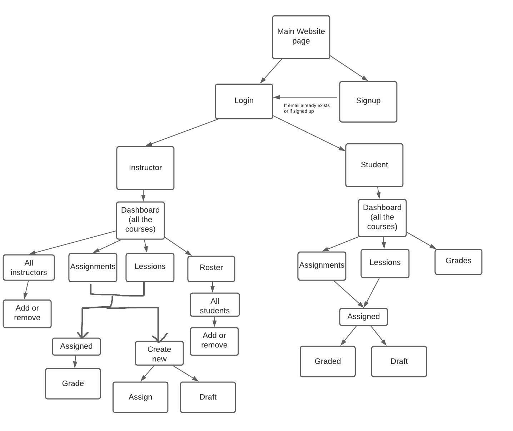
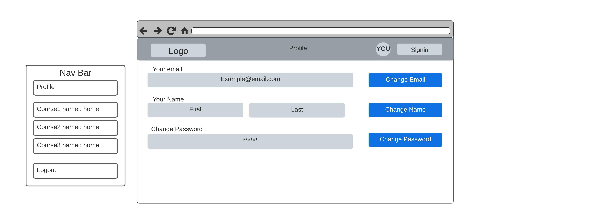
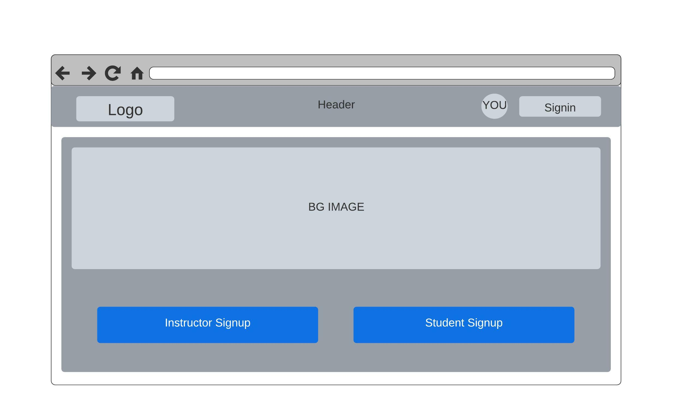
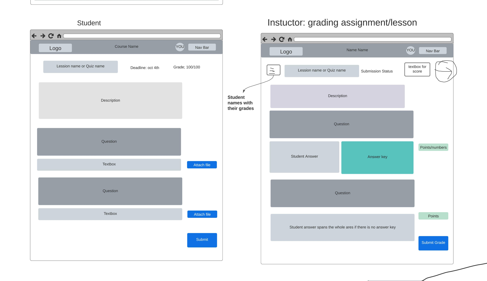
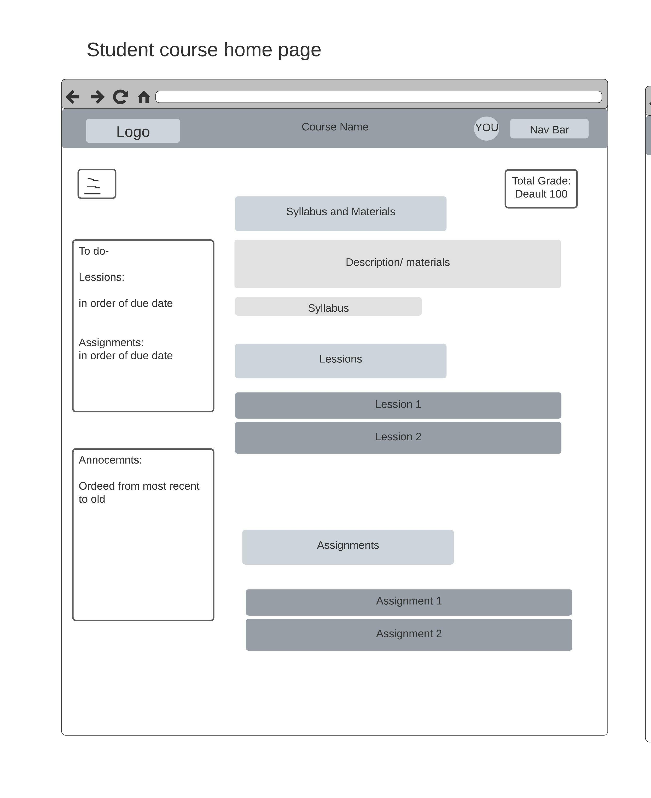
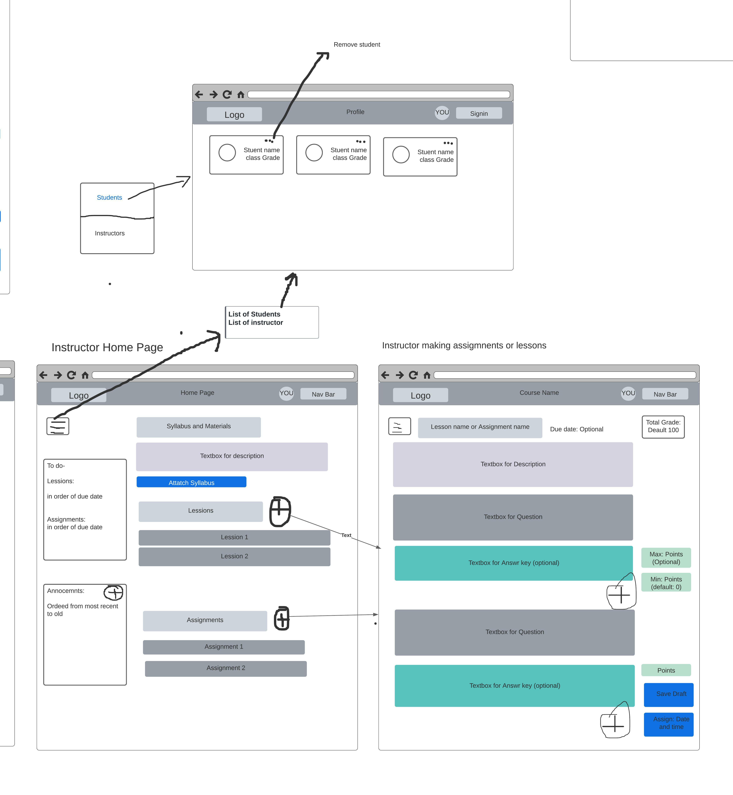
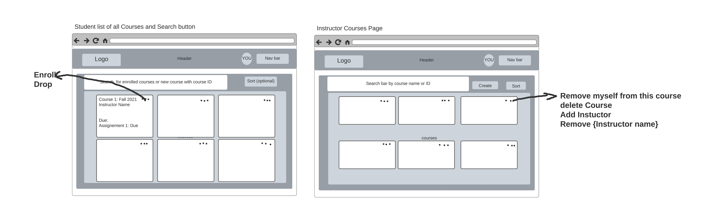
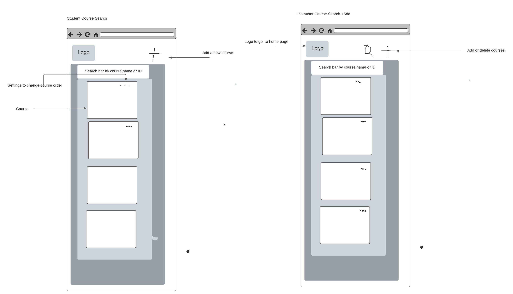

# ChalkBoard
https://demo-chalkboard.hafsahkamal.repl.co

## The link above directs users to the ChalkBoard HTML files.

## Team
Rupakshi Aggarwal, Hafsah Kamal

### Images below were constructed using LucidChart. 
Contributers: Rupakshi Aggarwal and Hafsah Kamal
### Image 1

### Image 2

### Image 3

### Image 4

### Image 5

### Image 6

### Image 7

### Image 8

## Website features:

#### These images display the site map (Image 1) and wireframe (Images 2-8) of our future distance-learning website "Chalkboard." 
The purpose of our website is to allow both students and teachers to learn and teach virtually. 
Before entering the main pages, users aka Student or Instructor must enter their username and password through the signup/signin page (Image 3).
Both Student and Instructor may view their course home page (Image 5), in which 
they can view their syllabus, textbook, lecture materials, and assignments.
Instructors have additional features in their pages where they can assign work, 
grade, and submit lectures. Students may save drafts/submit their assignments/lectures
which can instructors assign and grade (Image 4). 
Profile settings can also be changed, such as password and username (Image 2).
Students may add or drop a course, and Instructors can add or delete courses, 
add instructors to their courses, or remove themselves from a course (Image 7). --Hafsah Kamal

#### Features of ChalkBoard
ChalkBoard consists of different webpages to allow a seamless online learning experience. As of now, it contains:
A login page: (https://rupakshi1999.github.io/cs355-agru2717.github.io/index.html) in which users have the option of accessing their student/instructor account through the login button, or signing up (https://rupakshi1999.github.io/cs355-agru2717.github.io/HTML/SignUp.html).
A landing page: (https://rupakshi1999.github.io/cs355-agru2717.github.io/HTML/Index.html?submit=Login) which is used to connect all pages (student, instructor and admin view) together temporarily. This page can be accessed by clicking "login" in from the index.html.
##### Clicking All Courses: Instructor From the NavBar in the Landing Page:
Clicking this navbar item opens the courses/home page (https://rupakshi1999.github.io/cs355-agru2717.github.io/HTML/InstructorView/InstructorCoursesHomePage.html) for an instructor and displays currently taught courses (ex. Geology, Geography, Math). This page also contains a search bar, as well as a navbar which links the instructor to their profile, and provides clear options to create/delete (drop) a course in other pages. 
Clicking on a course from the courses/home page opens the course page (https://rupakshi1999.github.io/cs355-agru2717.github.io/HTML/InstructorView/InstructorCourseHomePage.html), with more specific information for the instructor, as well as a navbar that provides links to the instructor's profile page, creating/grading tests, and a "My Courses" button to once again access the courses/home page for an instructor. 
##### Clicking All Courses: Student from the NavBar in the Landing Page:
Clicking this navbar item opens the courses/home page (https://rupakshi1999.github.io/cs355-agru2717.github.io/HTML/StudentView/StudentCoursesHomePage.html) for a student and displays currently taught courses (ex. Geology, Geography, Math). This page also contains a search bar, as well as a navbar which links the student to their profile.
Clicking on a course from the courses/home page opens the course page (https://rupakshi1999.github.io/cs355-agru2717.github.io/HTML/StudentView/StudentCoursePage.html), with more specific information for the student, as well as a navbar that provides links to the student's profile page, taking lesson questions/quizzes/exams (https://rupakshi1999.github.io/cs355-agru2717.github.io/HTML/StudentView/StudentTestTaking.html), and a "My Courses" button to once again access the courses/home page for a student. 
##### Clicking Admin View from the NavBar in the Landing Page:
Clicking this navbar item opens the admin view (https://rupakshi1999.github.io/cs355-agru2717.github.io/HTML/AdminView/AdminView.html), which we plan to connect to a database as the semester progresses.

##### CSS In Our Website:
Seeing as frameworks such as Bootstrap is permissible to use in our project, we decided to implement Bootstrap early on in our project in order to streamline the process. Our CSS file can be located in our file called "style.css," located in the ChalkBoard directory. We've checked for responsiveness as well as make sure no content is hidden from users.  
#### What we learned:
11/02-03/2021
"I specifically learned a lot about git due to Rupakshi. Some keywords include "git branch", "git checkout -b <name>", and in general "git status" to check the changes of my repositories (in the origin and local repo). I also struggled in finding a way to edit HTML text for the "TeacherCreatingTest" page, because I did not even realize text could be editable after being placed in the DOM tree, so that was fascinating, realizing that text could be manipulated using basic HTML.
  Rupakshi and I also discussed using Bootstrap to add our styles and make our webpages reponsive so we did so by copy-pasting our <head> tags in each of our HTML files, but I think we will just import our necessary stylesheets and scripts next time.
  One thing I've also learned is that we have a long way to go. Just these few pages took more than 6-8 hours for me, so I know we need to put in our utmost effort to create an end result that we are proud to display."
  
#### New Updates (Deliverable 2):
As of 11/22/2021, our website contains code which confirms to the guidelines adhered by https://validator.w3.org/. We have removed <style> tags from our main HTML and moved our CSS files to a new directory altogether.
  Our nav bars, which had "#" as filler code previously, are now fully functional in all pages, with care taken to make sure pages the instructor may see, the students cannot access. In addition to this, we had images which had not matched the subject being taught; this has now been resolved. New html pages have been added to reflect the courses being taught (for now). RWD has also been reflected in our inclusion of the Bootstrap framework.
 These changes cannot be seen in the main branch just yet, but can be looked at via https://github.com/Rupakshi1999/cs355-agru2717.github.io/tree/Hafsah_CB/ChalkBoard.
