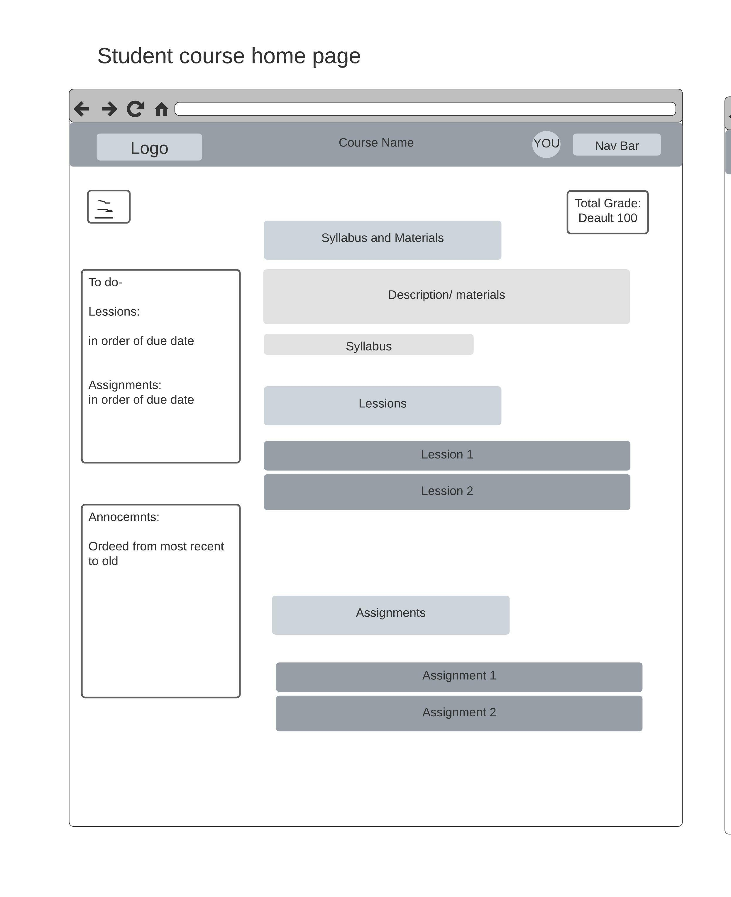

# ChalkBoard
https://github.com/Rupakshi1999/cs355-agru2717.github.io/tree/main/ChalkBoard/HTML

## The link above directs users to the ChalkBoard HTML files.

## Team
Rupakshi Aggarwal, Hafsah Kamal

### Images below were constructed using LucidChart. 
Contributers: Rupakshi Aggarwal and Hafsah Kamal
### Image 1

### Image 2

### Image 3

### Image 4

### Image 5

### Image 6

### Image 7

### Image 8

## Website features:

